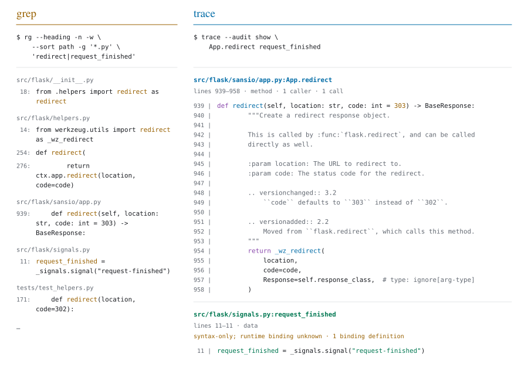
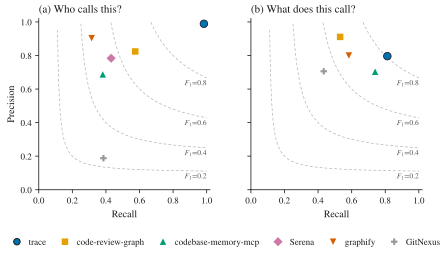
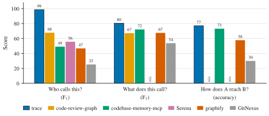
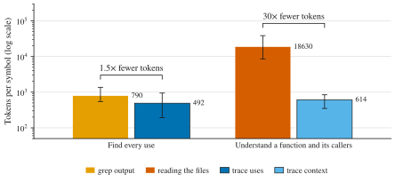
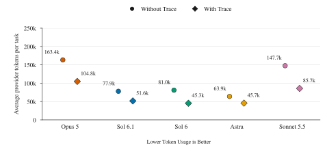
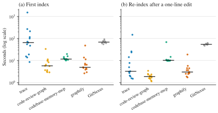

<h1 align="center">
  <picture>
    <source media="(prefers-color-scheme: dark)" srcset="docs/images/logo-dark.svg">
    
  </picture>
</h1>

<p align="center"><strong>Follow the code. See the impact.</strong><br>
Source, callers, dependencies and call paths for developers and AI agents.</p>

<p align="center">
  <a href="#languages"></a>
  
  <a href="LICENSE"></a>
  
</p>

<p align="center">
  <a href="#installation">Installation</a> ·
  <a href="#usage">Usage</a> ·
  <a href="#results">Results</a> ·
  <a href="#languages">Languages</a> ·
  <a href="#methodology">Methodology</a> ·
  <a href="CHANGELOG.md">Changelog</a>
</p>

trace is a read-only CLI that maps code and its relationships for AI agents.
Its goal is to provide the minimum useful context while keeping requested source complete.
In our ten-task comparison, agents using trace consumed **37.6% fewer tokens on average** than agents using standard tools.

## Installation

```sh
npm install -g @jameslovespancakes/trace
cd my-project
trace index
```

## Usage

| Command | What you get |
|:--|:--|
| `trace show <symbol>...` | Complete, numbered source; independent batch results |
| `trace symbols [query]` | Names, body identifiers and test candidates |
| `trace search <literal>` | Bounded literal source previews, including anonymous scopes |
| `trace source <file> --start <line> --lines <count>` | Explicit source window with absolute lines |
| `trace context <symbol>` | Source, callers, callees and tests |
| `trace uses <symbol>` | References, entry points and affected tests |
| `trace deps <symbol>` | Dependencies and call conditions |
| `trace path <a> <b>` | Call paths and values passed along |

Known names can go straight to batched `show`; discovery is optional.

### Example

<p align="center">
  <picture>
    <source media="(prefers-color-scheme: dark)" srcset="docs/images/grep-vs-trace-dark.svg">
    
  </picture>
</p>

## Results

### Code accuracy

**98% of callers found, 1% wrong answers** on the evaluated repositories.

<p align="center">
  <picture>
    <source media="(prefers-color-scheme: dark)" srcset="docs/images/precision-recall-dark.svg">
    
  </picture>
</p>
<p align="center"><sub>Precision and recall. Higher and farther right is better.</sub></p>

<p align="center">
  <picture>
    <source media="(prefers-color-scheme: dark)" srcset="docs/images/accuracy-dark.svg">
    
  </picture>
</p>
<p align="center"><sub>Caller and callee F₁ scores; correctly traced call chains. n/a means unsupported.</sub></p>

### Smaller answers

<p align="center">
  <picture>
    <source media="(prefers-color-scheme: dark)" srcset="docs/images/token-cost-dark.svg">
    
  </picture>
</p>
<p align="center"><sub>Tokens returned per symbol. Median and interquartile range, log scale; lower is better.</sub></p>

### Agent efficiency

**37.6% fewer tokens per task** across five models and ten short, medium and long tasks.

<p align="center">
  <picture>
    <source media="(prefers-color-scheme: dark)" srcset="docs/images/agent-tokens-per-task-dark.svg">
    
  </picture>
</p>

### Indexing

<p align="center">
  <picture>
    <source media="(prefers-color-scheme: dark)" srcset="docs/images/index-time-dark.svg">
    
  </picture>
</p>
<p align="center"><sub>Indexing time. Dots are repositories; bars are medians. Log scale, lower is better.</sub></p>

## Languages

| Languages | Setup |
|:--|:--|
| Python, JavaScript, TypeScript, Bash | Automatic |
| Go, Java, C, C++, C#, Rust | Automatic; some project builds require approval |
| PHP, Scala, Haskell, R | Install on request |

Each project needs its toolchain and dependencies installed.
On ARM, install clangd yourself; non-SDK C# projects require Windows.
Rust needs `rust-src`; PHP requires accepting the Intelephense licence.

```sh
trace status --install scala      # install an on-request server
trace index --env /path/to/.venv   # select a Python environment
trace index --allow-build         # approve builds for a trusted project
```

## How it works

trace parses source, resolves calls with language servers, and follows library code.
Results are static evidence, not a guarantee of execution.

| Mark | Meaning |
|:--|:--|
| none | Proven by a compiler, language server or language rule |
| `~` | Inferred |
| `?` | Possible |

Unresolved or bounded results are explicit. The first index is slower; later queries reuse the cache.

## Privacy and control

- **Read-only source.** Inspected files are never modified; `.env` files are excluded. Caches live outside the project.
- **Explicit build approval.** Project build scripts and macros require `--allow-build`; use it only on trusted projects.
- **Verified tools.** Language-server downloads are pinned and SHA-256 checked.
- **No AI, no telemetry.** Source never leaves your machine; every result is computed locally.
- **Offline mode.** `TRACE_OFFLINE=1` disables automatic language-server installs.

## Building from source

Requires Rust 1.92; Windows builds use MSVC or MinGW.

```sh
cargo build --release
cargo nextest run --release --workspace
```

[Build and release details](.github/CI.md).

## Methodology

- **Code tools:** six tools on 13 pinned repositories. Source-labelled callers of 29 symbols, callees of 26 functions and 26 two-step call chains. Output tokens use `o200k_base`.
- **Indexing:** trace timings use a frozen start-of-run build, fresh Trace caches and installed dependencies; later source edits are excluded. Other tools retain their earlier timings. One run per repository; the edit appends one newline.
- **Agents:** 160 counterbalanced sessions, five models and ten reused tasks. Repetitions are averaged within each model/task, then tasks weighted equally. Tokens include cached replay; timing excludes indexing/setup.
- **Answer quality:** factual fields 915/920 without trace versus 914/920 with it; citations 367/370 versus 368/370. Scoring was source-reviewed, not blinded.
- **Scope:** results describe the tested build, not later retrieval changes or coding success.

---

[MIT licensed](LICENSE). Language servers have their own licences.
